# AttendTrack - School Attendance Management System

A modern, production-ready School Attendance Portal built with React + Vite. Designed for teachers and admins to manage attendance, exams, grades, timetables, and more.

**Live Demo:** [https://schoolattendancemanagementsystem.vercel.app](https://schoolattendancemanagementsystem.vercel.app)

## Screenshots

### Login Page
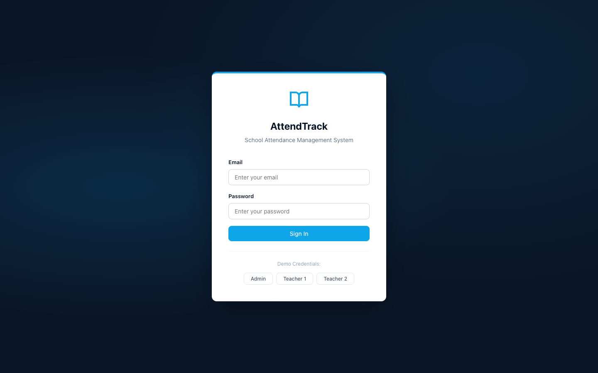

### Dashboard
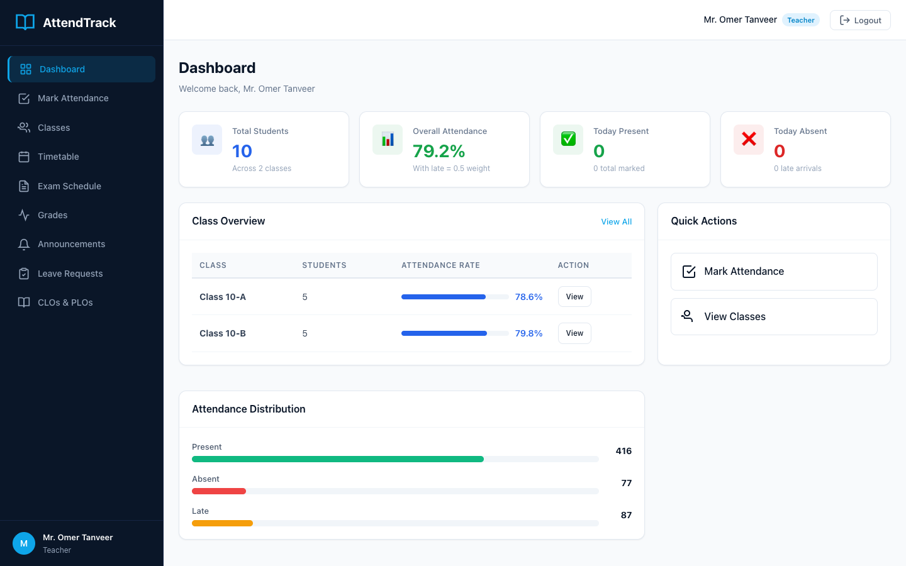

### Mark Attendance
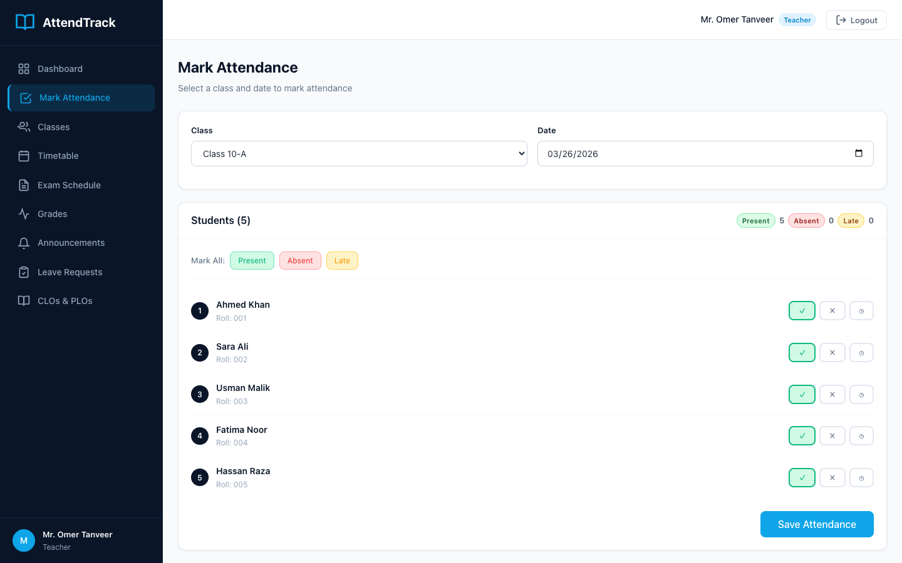

### Class View - Student Attendance Summary
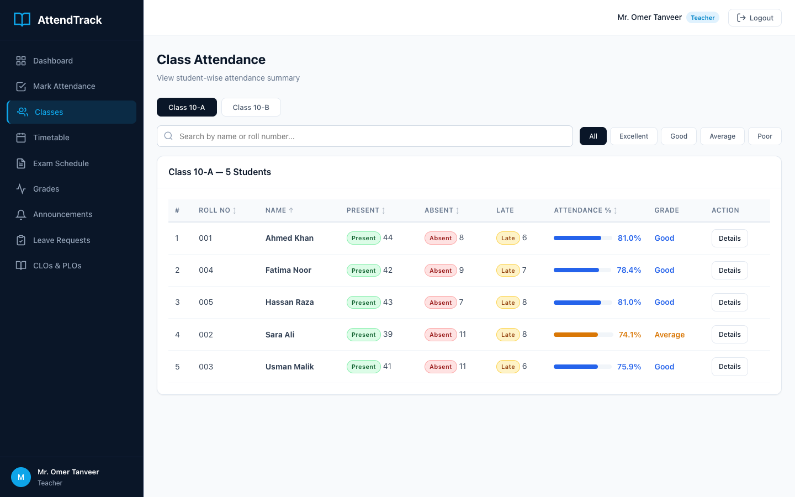

### Class Timetable
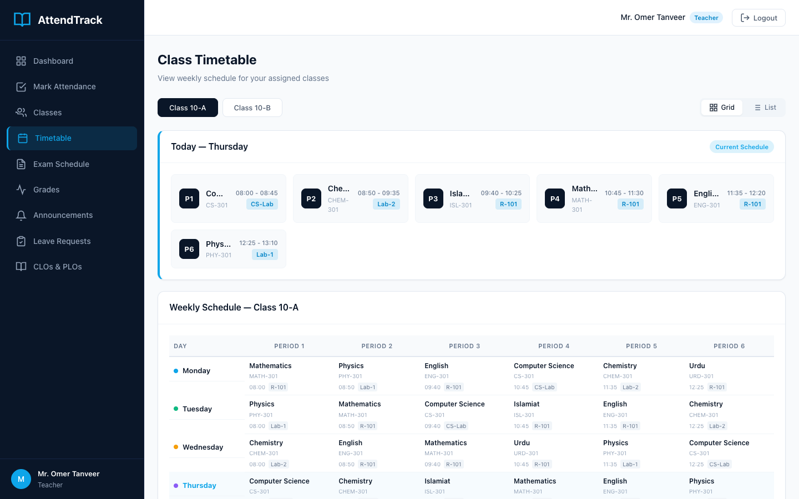

### CLO Details
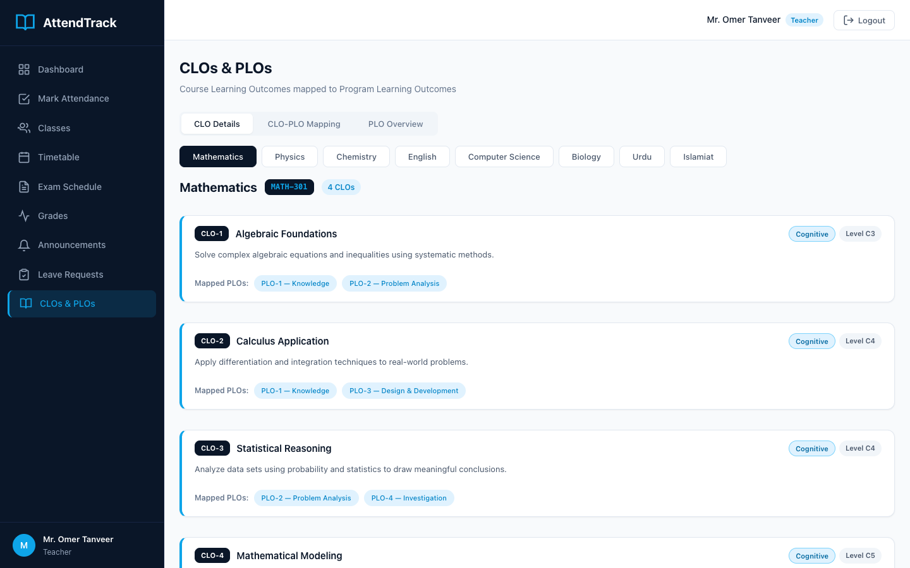

### CLO-PLO Mapping Matrix
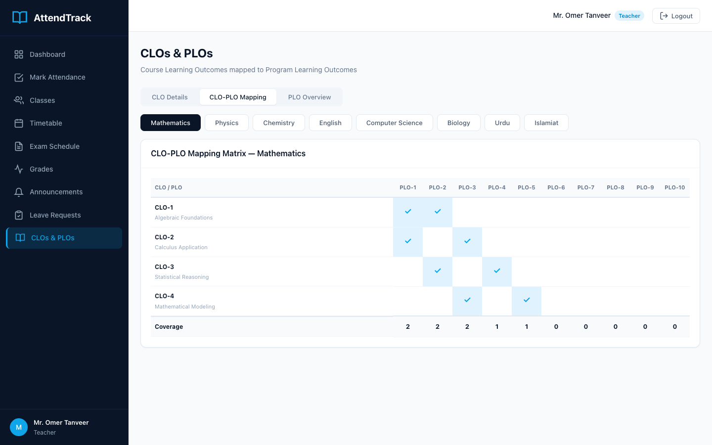

### Exam Schedule
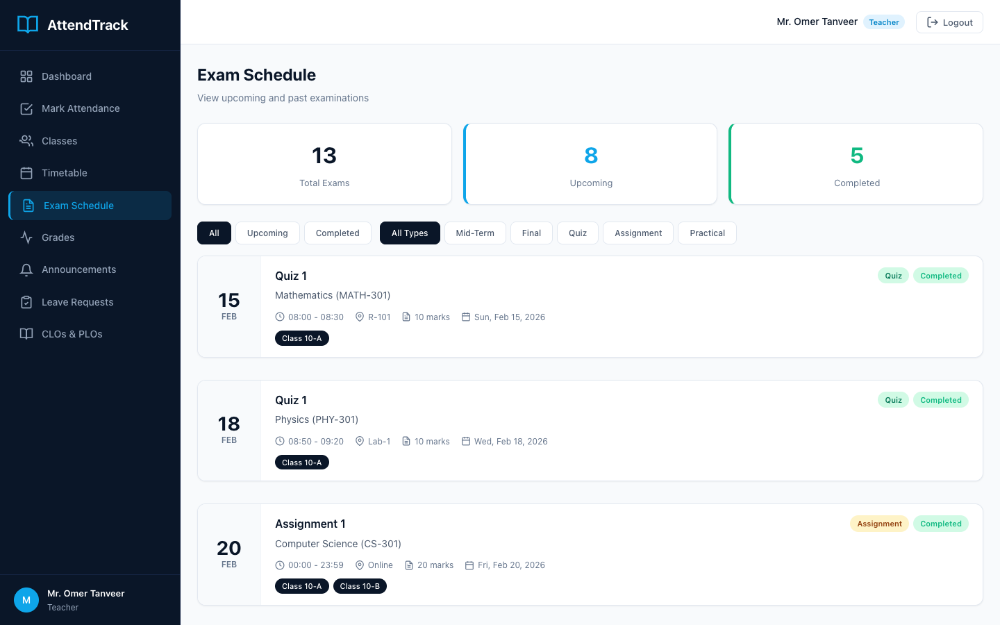

### Student Grades
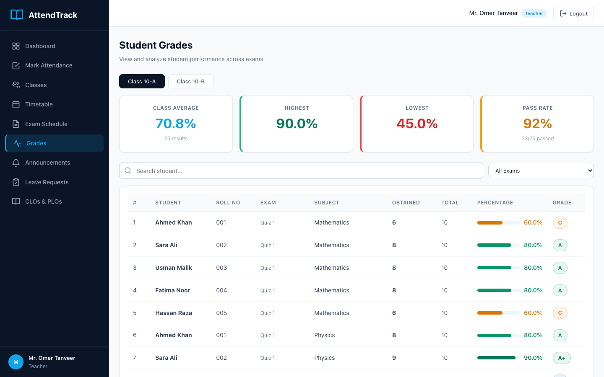

### Announcements
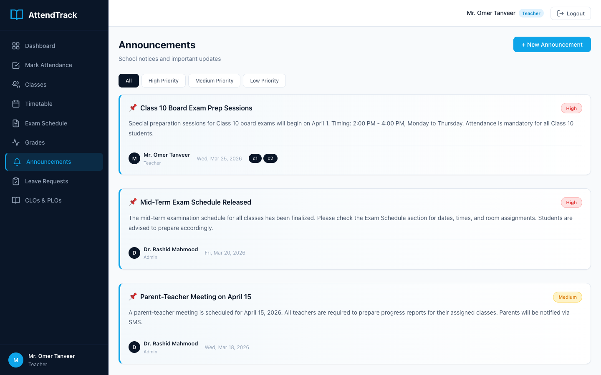

### Leave Management
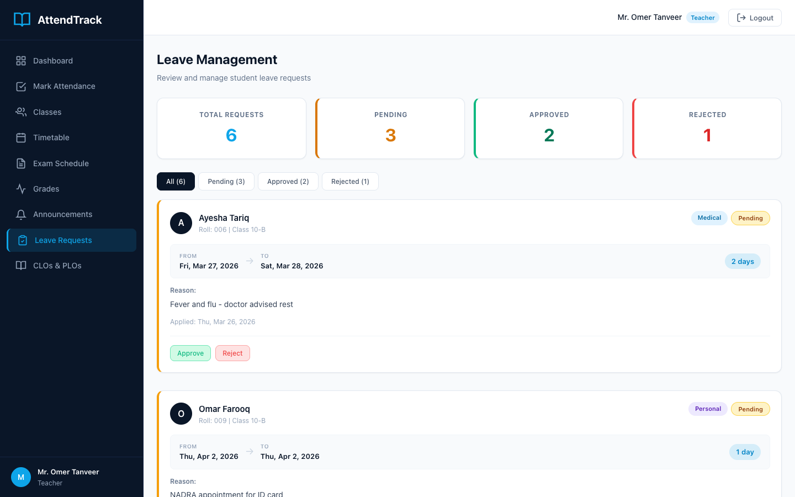

### Settings (Admin)
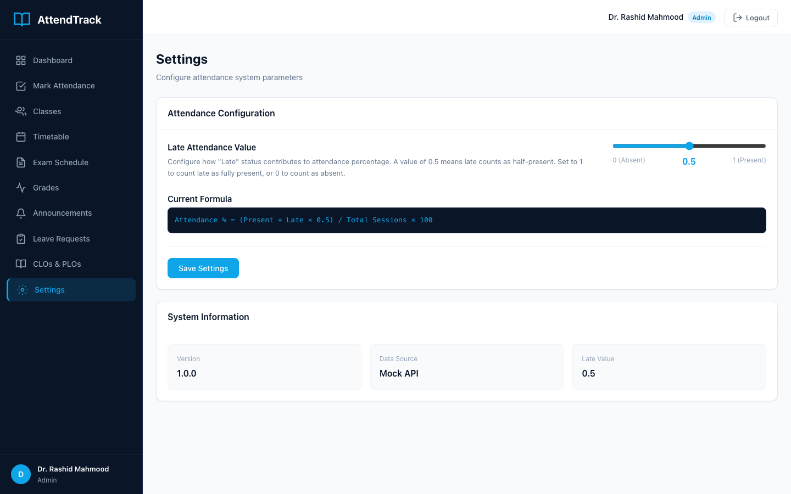

## Features

- **Attendance Tracking** - Mark students as Present, Absent, or Late with date-based tracking
- **Configurable Late Value** - Late counts as a configurable partial value (0-1) in percentage calculations
- **Dashboard** - Class-wise summaries, attendance distribution, and quick actions
- **Class View** - Sortable and filterable tables with attendance grades (Excellent/Good/Average/Poor)
- **Student Detail** - Individual attendance history with visual heatmap and monthly filters
- **Timetable** - Weekly schedule with grid and list views, today's schedule highlighted
- **CLOs & PLOs** - Course/Program Learning Outcomes with mapping matrix and coverage analysis
- **Exam Schedule** - Upcoming and past exams with type filters (midterm/final/quiz/practical)
- **Grades** - Student performance tracking with class average, pass rate, and letter grades
- **Announcements** - Notice board with priority levels (high/medium/low), pinned notices, and creation modal
- **Leave Management** - Student leave requests with approve/reject actions and status tracking
- **Role-Based Access** - Teacher and Admin views with different permissions
- **Responsive Design** - Works across desktop, tablet, and mobile devices

## Tech Stack

- **React 19** with JSX
- **Vite 8** for build tooling
- **React Router v7** for navigation
- **CSS** custom properties with Navy Blue + Electric Blue + White theme
- **Mock API** with simulated async delays

## Demo Credentials

| Role | Email | Password |
|------|-------|----------|
| Admin | admin@school.edu | admin123 |
| Teacher 1 | omer@school.edu | teacher123 |
| Teacher 2 | check@school.edu | teacher123 |

## Getting Started

```bash
npm install
npm run dev
```

## Build

```bash
npm run build
npm run preview
```
